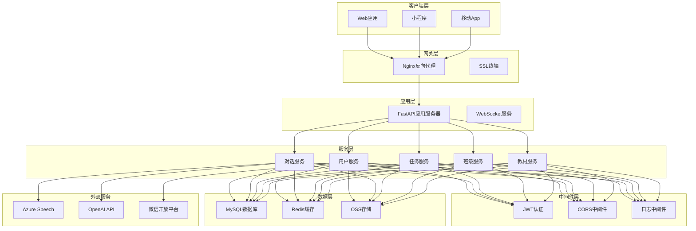
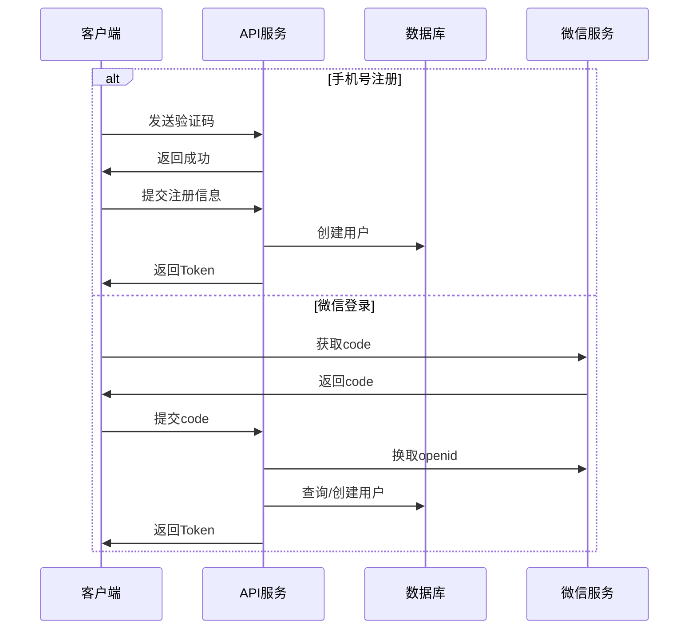
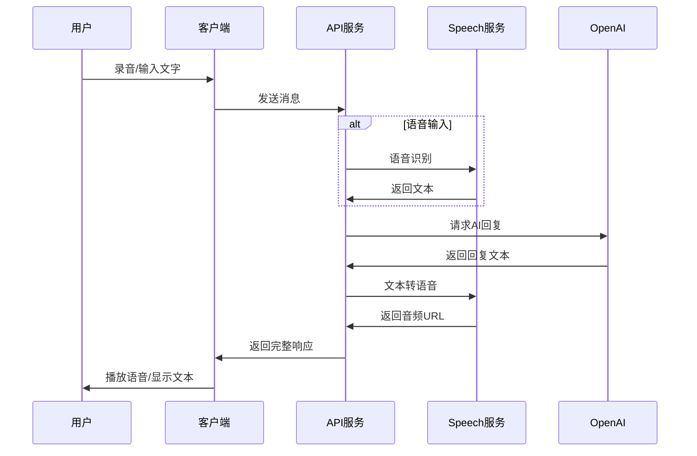
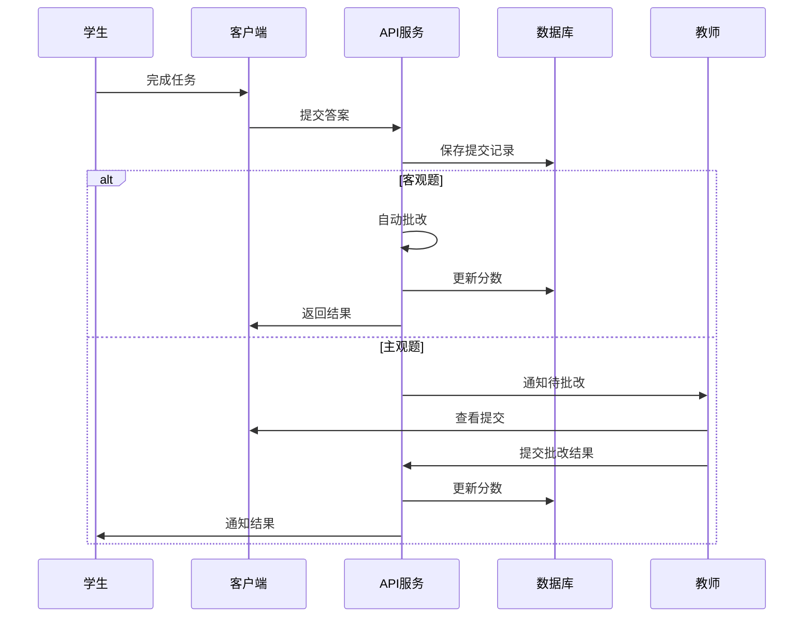

# AI-Speak 技术设计文档

## 1. 系统架构设计

### 1.1 整体架构


### 1.2 技术栈选型理由

#### 前端技术选型
- **UniApp**: 一次开发，多端部署，降低开发成本
- **Vue 3**: 组合式API，更好的TypeScript支持
- **Vite**: 快速的开发构建工具，提升开发体验
- **Pinia**: 轻量级状态管理，替代Vuex

#### 后端技术选型
- **FastAPI**: 高性能异步框架，自动生成API文档
- **SQLAlchemy 2.0**: 现代ORM，支持异步操作
- **Alembic**: 数据库版本控制，便于迁移
- **Gunicorn + Uvicorn**: 生产级ASGI服务器

## 2. 数据库设计

### 2.1 核心实体关系图
```mermaid
erDiagram
    Account ||--o{ AccountSettings : has
    Account ||--o{ MessageSession : creates
    Account ||--o{ Class : teaches/joins
    Account ||--o{ StudyRecord : records
    
    MessageSession ||--o{ Message : contains
    
    Class ||--o{ ClassMember : has
    Class ||--o{ Task : assigns
    
    Task ||--o{ Submission : receives
    Task ||--o{ TaskAttachment : includes
    
    Submission ||--o{ SubmissionDetail : contains
    
    TextBook ||--o{ TextBookUnit : contains
    TextBookUnit ||--o{ TextBookSection : contains
    TextBookSection ||--o{ Word : includes
    TextBookSection ||--o{ Sentence : includes
```

### 2.2 核心数据表设计

#### Account (用户账户表)
```sql
- id: UUID PRIMARY KEY
- mobile: VARCHAR(20) UNIQUE
- username: VARCHAR(50) UNIQUE
- password_hash: VARCHAR(255)
- role: ENUM('student', 'teacher', 'parent')
- status: ENUM('active', 'inactive', 'suspended')
- created_at: TIMESTAMP
- updated_at: TIMESTAMP
- deleted_at: TIMESTAMP NULL
```

#### MessageSession (会话表)
```sql
- id: UUID PRIMARY KEY
- account_id: UUID FOREIGN KEY
- session_type: ENUM('ai_chat', 'study', 'practice')
- metadata: JSON
- created_at: TIMESTAMP
- updated_at: TIMESTAMP
```

#### Task (任务表)
```sql
- id: INTEGER PRIMARY KEY
- class_id: INTEGER FOREIGN KEY
- title: VARCHAR(200)
- task_type: ENUM('dictation', 'spelling', 'pronunciation', 'reading', 'quiz')
- content: JSON
- start_time: TIMESTAMP
- end_time: TIMESTAMP
- status: ENUM('draft', 'published', 'closed')
- created_by: UUID FOREIGN KEY
- created_at: TIMESTAMP
```

## 3. API接口设计

### 3.1 RESTful API规范
- 基础路径: `/api/v1`
- 认证方式: Bearer Token (JWT)
- 响应格式: JSON
- 错误处理: 统一错误码体系

### 3.2 核心API接口

#### 用户认证接口
```yaml
POST /api/v1/auth/register
  描述: 用户注册
  请求体:
    - mobile: string
    - password: string
    - code: string (验证码)
  响应:
    - access_token: string
    - user_info: object

POST /api/v1/auth/login
  描述: 用户登录
  请求体:
    - username: string
    - password: string
  响应:
    - access_token: string
    - refresh_token: string
    - user_info: object

POST /api/v1/auth/wechat
  描述: 微信登录
  请求体:
    - code: string
  响应:
    - access_token: string
    - user_info: object
```

#### AI对话接口
```yaml
POST /api/v1/chat/message
  描述: 发送消息
  请求体:
    - session_id: string
    - content: string
    - type: enum(text, audio)
    - audio_data: base64 (可选)
  响应:
    - message_id: string
    - ai_response: object
      - text: string
      - audio_url: string
      - assessment: object (语音评估)

GET /api/v1/chat/sessions
  描述: 获取会话列表
  参数:
    - page: integer
    - limit: integer
  响应:
    - sessions: array
    - total: integer

POST /api/v1/chat/speech/synthesize
  描述: 文本转语音
  请求体:
    - text: string
    - voice: string
    - speed: float
  响应:
    - audio_url: string
```

#### 任务管理接口
```yaml
POST /api/v1/tasks
  描述: 创建任务
  请求体:
    - class_id: integer
    - title: string
    - task_type: enum
    - content: object
    - attachments: array
    - start_time: datetime
    - end_time: datetime
  响应:
    - task_id: integer
    - status: string

GET /api/v1/tasks/{task_id}
  描述: 获取任务详情
  响应:
    - task: object
    - submissions: array
    - statistics: object

POST /api/v1/tasks/{task_id}/submit
  描述: 提交任务
  请求体:
    - answers: array
    - attachments: array
  响应:
    - submission_id: integer
    - auto_score: object
    - status: string

PUT /api/v1/submissions/{submission_id}/grade
  描述: 教师批改
  请求体:
    - scores: array
    - comments: string
    - total_score: integer
  响应:
    - status: string
```

## 4. 系统交互流程

### 4.1 用户认证流程


### 4.2 AI对话流程


### 4.3 任务提交流程


## 5. 安全设计

### 5.1 身份认证
- JWT令牌有效期: 7天
- Refresh Token有效期: 30天
- 支持Token黑名单机制

### 5.2 数据加密
- 密码: bcrypt加密（成本因子12）
- 传输: HTTPS/TLS 1.3
- 敏感数据: AES-256加密存储

### 5.3 访问控制
```python
# 基于角色的访问控制示例
@router.get("/tasks/{task_id}")
@require_roles(["teacher", "student"])
async def get_task(task_id: int, current_user: User):
    if current_user.role == "student":
        # 学生只能查看已发布的任务
        return get_published_task(task_id)
    else:
        # 教师可以查看所有任务
        return get_task_full(task_id)
```

### 5.4 API限流
- 全局限流: 1000次/分钟/IP
- 用户限流: 100次/分钟/用户
- AI接口限流: 20次/分钟/用户

## 6. 性能优化设计

### 6.1 缓存策略
- Redis缓存热点数据
- 缓存用户设置、班级信息
- 教材内容CDN分发

### 6.2 数据库优化
- 合理使用索引
- 读写分离（未来）
- 分表分库（未来）

### 6.3 异步处理
- 语音处理异步队列
- 批量任务异步处理
- WebSocket实时通信

## 7. 部署架构

### 7.1 容器化部署
```yaml
version: '3.8'
services:
  backend:
    image: aispeak-backend:latest
    ports:
      - "8097:8097"
    environment:
      - DATABASE_URL=mysql://...
      - REDIS_URL=redis://...
    deploy:
      replicas: 3
      
  frontend:
    image: aispeak-frontend:latest
    ports:
      - "80:80"
      - "443:443"
    volumes:
      - ./ssl:/etc/nginx/ssl
      
  redis:
    image: redis:alpine
    volumes:
      - redis_data:/data
      
  mysql:
    image: mysql:8.0
    volumes:
      - mysql_data:/var/lib/mysql
```

### 7.2 监控告警
- Prometheus + Grafana监控
- ELK日志收集分析
- 钉钉/企业微信告警

## 8. 扩展性设计

### 8.1 微服务化路径
- 用户服务独立部署
- AI服务独立扩展
- 消息队列解耦

### 8.2 多租户支持
- 租户数据隔离
- 独立域名支持
- 定制化配置

### 8.3 插件化架构
- 支持第三方AI服务
- 可扩展的任务类型
- 自定义评分规则